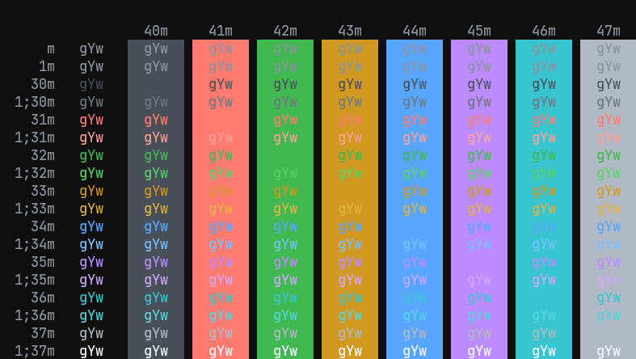
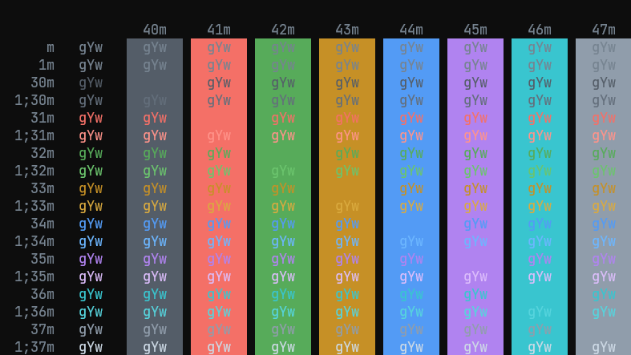
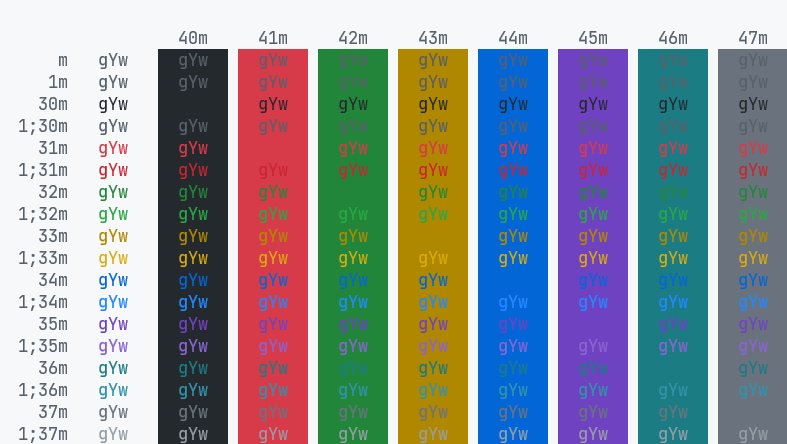

# Windows Terminal GitHub Theme
GitHub's themes for Windows Terminal.

## Dark Theme

## Dimmed Theme

## Light Theme

## Install

Start Windows Terminal and click on the down arrow symbol `˅` from menu bar. This will open a drop down menu from which select Settings option. Alternatively use `Ctrl + ,` to open Settings directly.

In the `settings.json` settings file for Windows Terminal, find the `schemes` section and paste the content of `./dist/schemes.json`.

Alternatively, clone this repo, install its dependencies, and run `npm run build`. This will generate a new `./dist/schemes.json` file with the latest color changes by GitHub.